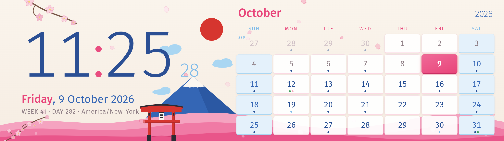
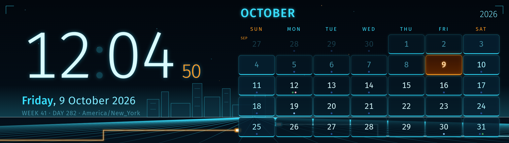
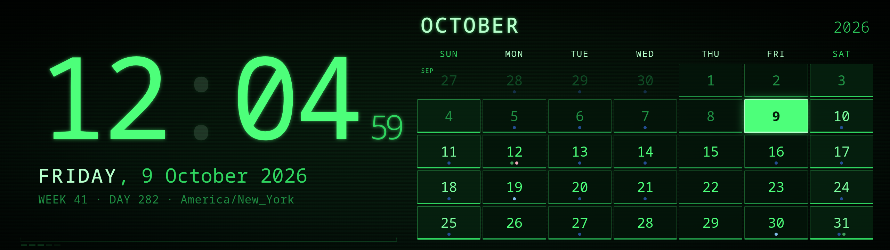
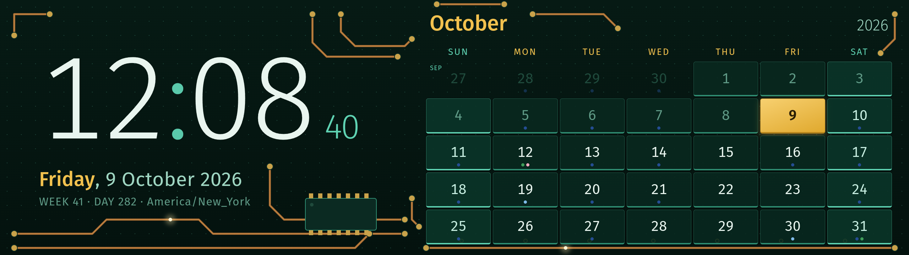
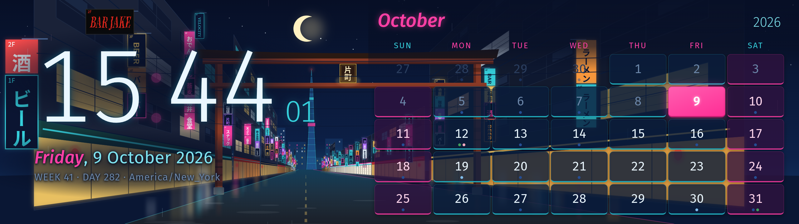
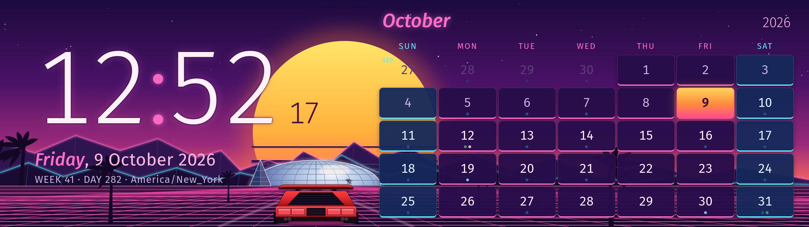
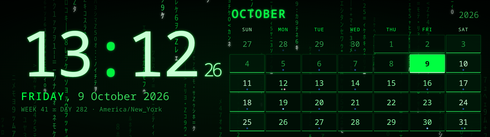
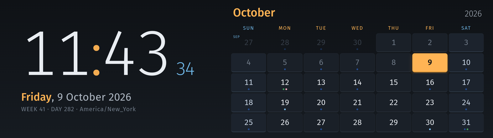
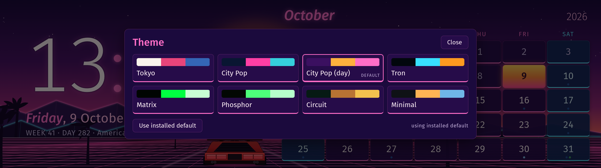

# Edge Dash

A clock and month calendar for the **Corsair Xeneon Edge** (14.5", 2560×720 touchscreen)
on Linux, with no iCUE. Press and hold a day to see that day's events from any number
of ICS calendar feeds (Google, Outlook/M365, Nextcloud…).



Built and used on CachyOS + KDE Plasma 6 (Wayland). The theme is a nod to the Akko
"World Tour Tokyo" keycap set: cream, sakura pink, Fuji blue, a red sun, a torii gate
and drifting petals.

## What it does

- **24-hour clock** with seconds, date, ISO week and day of year.
- **Month calendar**, Sunday or Monday start, always at least five full weeks
  (six when needed), padded with the neighbouring months' days (or blank leading cells,
  one flag); today highlighted.
- **Month browsing**: swipe left/right on the calendar to page through months. A
  **Today** button appears beside the month name while you're away, and the view snaps
  back to the current month on its own after a minute and a half idle.
- **Calendar feeds**: a small fetcher merges ICS feeds into `schedule.json` every
  15 minutes. Days with events get a dot per calendar; **hold a day** and the clock
  side swaps to that day's agenda, release to go back.
- **Kiosk**: a fullscreen QtWebEngine window that pins itself to the Edge's output and
  re-pins on hotplug. No browser profile, no Electron, no build step.

**Themes** are drop-in folders: a CSS token file, an optional 2560×720 SVG scene and
an optional particle config. See [THEMES.md](THEMES.md) to make your own without
touching the logic. Eight ship in `themes/`; see *Switching themes* below.

| | |
|---|---|
| **tokyo** (default) — the Akko set, above | **tron** — neon grid, light-cycle trails, drifting bits<br> |
| **phosphor** — green CRT, monospace, scanlines<br> | **circuit** — copper traces on solder mask<br> |
| **citypop** — Katamachi, Fukui at night: a narrow neon street through an old 片町 torii<br> | **citypop-day** — synthwave sunset: big striped sun, a coupe on a rolling grid<br> |
| **matrix** — phosphor's sibling with digital rain<br> | **minimal** — bare dark, the template to copy<br> |

## Requirements

- Linux with Qt 6: `qt6-declarative` (for `qml6`) and `qt6-webengine`
  (Arch: `sudo pacman -S qt6-declarative qt6-webengine`)
- [`uv`](https://docs.astral.sh/uv/) for the calendar fetcher (it resolves
  `icalendar` + `recurring-ical-events` on first run)
- A Wayland or X11 session with systemd user services. KDE Plasma gets extra
  automation (KWin rule, touchscreen mapping); other desktops work, you just map
  the touchscreen yourself.

## Install

```sh
git clone https://github.com/mrpestka/xeneon-edge-dash ~/projects/xeneon-edge-dash
cd ~/projects/xeneon-edge-dash
./install.sh                 # --output=DP-4 if auto-detection picks the wrong screen, --theme=minimal to switch themes
```

The installer renders the systemd user units with this checkout's path, enables
`edge-dash.service` (the kiosk, tied to your graphical session) and
`edge-schedule.timer` (the feed refresh), creates `~/.config/edge-dash/calendars.toml`
from the example, and on KDE hides the kiosk from the taskbar and maps the Edge's
touch digitizer to its output.

Then put your feeds in `~/.config/edge-dash/calendars.toml`:

```toml
[[calendar]]
name = "Family"
url = "https://calendar.google.com/calendar/ical/…/private-…/basic.ics"
color = "#244d93"
```

and refresh:

```sh
systemctl --user start edge-schedule && journalctl --user -u edge-schedule -n 5
```

`calendars.example.toml` explains where each provider hides its ICS link. Those links
are bearer tokens, so the file is created owner-only and lives outside the repo.

## Switching themes

Tap the panel's **top-left corner** (an invisible 260×220 px touchpoint; a small ring
confirms the tap) and a picker slides over the dashboard: one tile per theme with its
colour swatch, the current one outlined, the installed default labelled.



Tapping a tile switches the theme live, no reload, and the choice is remembered across
restarts until you tap **Use installed default**. The picker closes on *Close*, on a tap
outside it, or after 20 seconds idle. The same choice can be made from a shell:

```sh
./edge-dash.sh --set-theme=matrix      # store a panel choice
./edge-dash.sh --set-theme=default     # clear it, back to the installed theme
./install.sh --theme=tron              # change the installed default itself
```

## Day to day

```sh
systemctl --user restart edge-dash          # after editing index.html (or press F5 on the panel)
journalctl --user -u edge-dash -u edge-schedule -f
./edge-dash.sh --shot                       # run by hand, save screenshot.png after 4 s
./edge-dash.sh --shot --hold=2026-10-14     # same, with the day panel pinned open
./install.sh --uninstall
```

Keys while the kiosk has focus: `Esc` quit, `F5` reload, `F12` screenshot.
Touch: hold a day for its agenda; swipe left/right to change month (tap **Today** to
jump back); tap the top-left corner for the theme picker.
QtWebEngine up to 6.11.2 never garbage-collects its renderer, so memory grows with every
repaint until the process dies ([QTBUG-150024](https://bugreports.qt.io/browse/QTBUG-150024),
fixed upstream). The launcher exposes V8's collector and the page runs it every 30 seconds,
which keeps the renderer flat. As a safety net the kiosk also restarts itself once a day
(`--restart-hours=N`, 0 disables); the panel is blank for a few seconds while systemd
relaunches it. A crashed renderer is reloaded on the spot.

## Customising

| What | Where |
|------|-------|
| Colours, cards, fonts | `themes/<name>/theme.css` tokens (contract in THEMES.md) |
| Artwork | `themes/<name>/scene.svg`, 2560×720 |
| Petals / snow / particles | `themes/<name>/theme.json` |
| Week start, min. weeks, previous-month padding, refresh interval | the `settings` block at the top of the script in `index.html` |
| Which screen | `./install.sh --output=NAME`, or any 2560×720 screen by default |
| Feed range / timezone | `past_days`, `future_days`, `timezone` in `calendars.toml` |

## Layout

```
index.html             the page: clock, calendar, hold-to-view panel, theme loader
base.css               layout + token defaults (the theme contract)
themes/tokyo/          default theme: theme.css, scene.svg, theme.json
themes/minimal/        bare dark theme, the starting point for your own
themes/tron|phosphor|matrix|circuit|citypop|citypop-day/  more themes
themes/themes.json     which themes the picker lists, in order
THEMES.md              how to write a theme
kiosk.qml              fullscreen QtWebEngine window pinned to the Edge
edge-dash.sh           launcher (qml6)
fetch_schedule.py      ICS feeds -> schedule.json (uv script, deps inline)
systemd/*.service|timer  templates rendered by install.sh
install.sh             install / --uninstall
calendars.example.toml feed config template
```

## Notes for other hardware

The Edge shows up as a plain 2560×720 DisplayPort monitor over USB-C (EDID name
`XENEON EDGE`) plus a USB touch digitizer `27c0:0859 "wch.cn TouchScreen"`.
Brightness is on a separate USB HID channel that iCUE uses; DDC/CI does not answer.
Any other 2560×720 panel works unchanged; for other sizes adjust `--panel-w`/`--panel-h`
in `base.css` and `targetW`/`targetH` in `kiosk.qml`.

## License

MIT — see `LICENSE`.
